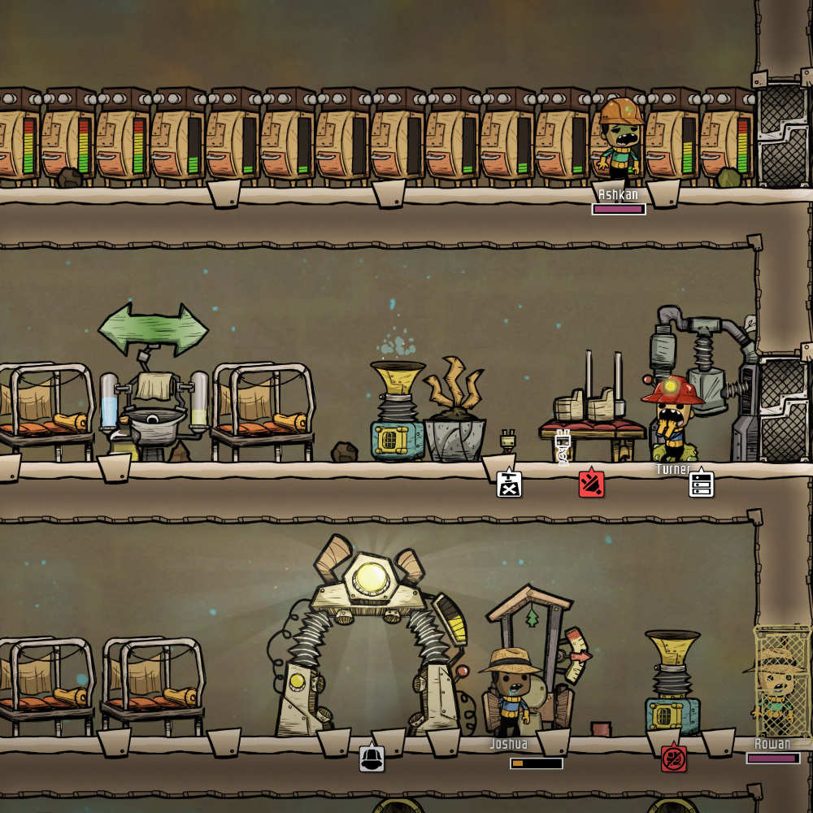
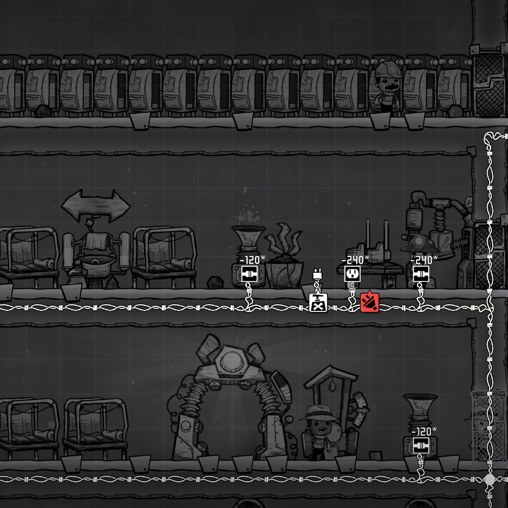
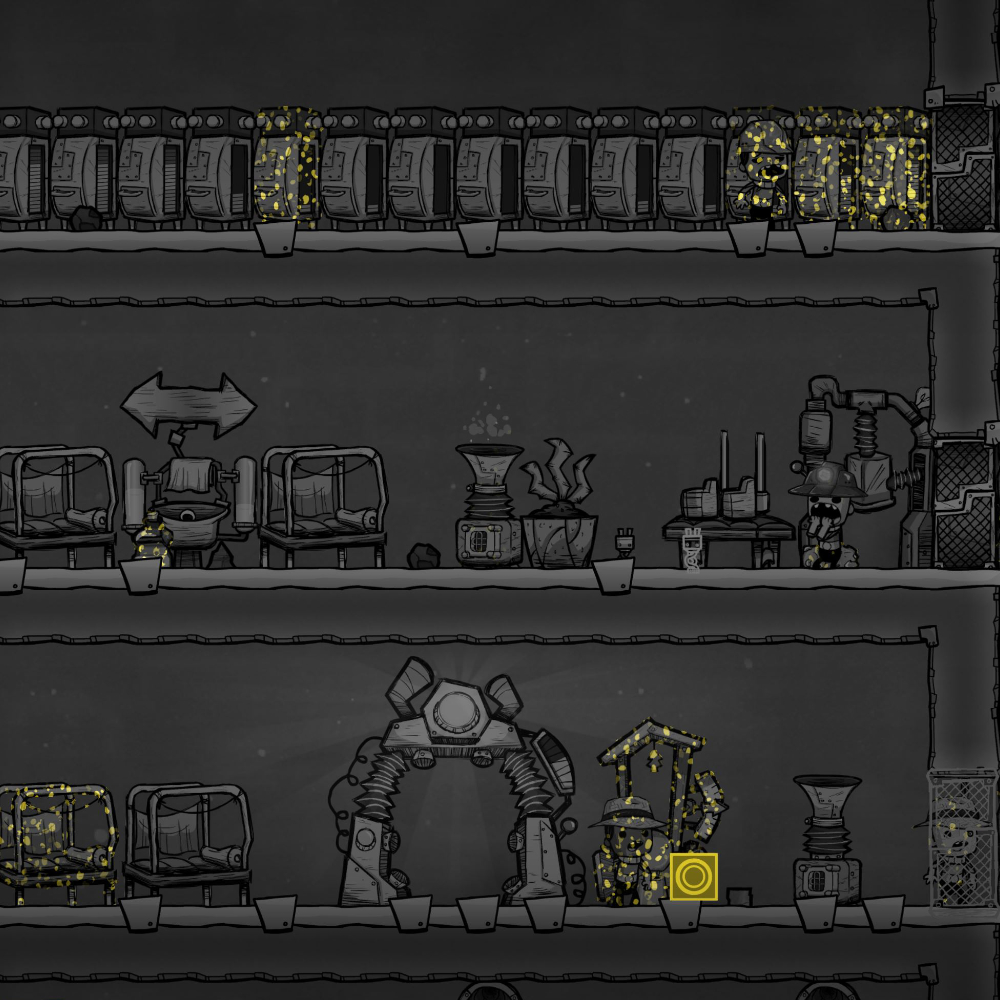
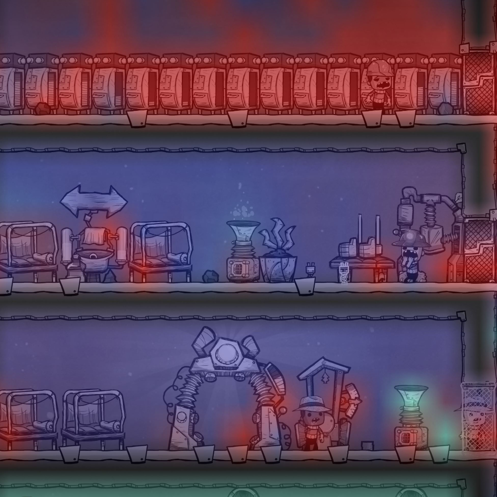

# Overlays

A module responsible for visualising peripheral data associated with the instances contained in a node space. Ties into the data association system provided by the backend, which allows the association of node spaces with numerical and categorical data. This feature is inspired by a system employed by the video game "Oxygen Not Included", as shown below. Within the game, players can visualise different otherwise hardly visible, if not completely invisible properties of a space. The images show in order from top left to bottom right: the basic view, an overlay showing electrical circuits, an overlay showing germs and an overlay showing air quality. A similar feature is proposed for the node compiler for debugging and optimisation purposes.

This feature is provided with the intention of empowering users to monitor a given node graph's stats visually. For example, specific programming nodes may be associated with numerical data representing a performance metric such as CPU cycle count estimations. Such data could then be accumulated with each abstraction level, allowing for a visualisation of "hot zones" within a program - which may be noteworthy targets for optimisation efforts.

While overlays should largely be user specified, not only in data association but also ultimate colour mapping - built-in functionalities can benefit from this system as well. For instance, *tunnels* are utilised to hide complex connection networks and make a specific node graph more maintainable. However, visualising where a tunnel is sending data within a node space may be beneficial in specific circumstances. The overlay system could then be used to toggle visibility during node graph development.

    
    
    
    

## Requires

- [Node](../nodes/node.md)

## Required By

*Nothing*
